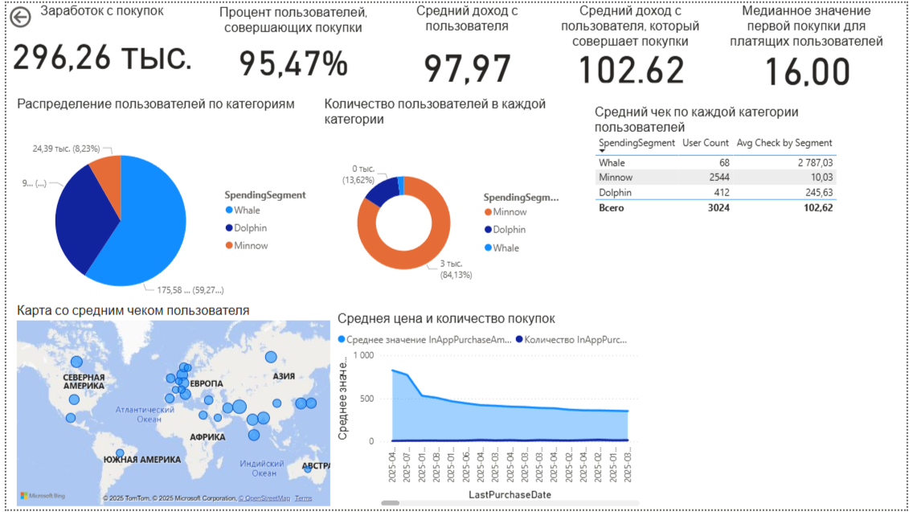
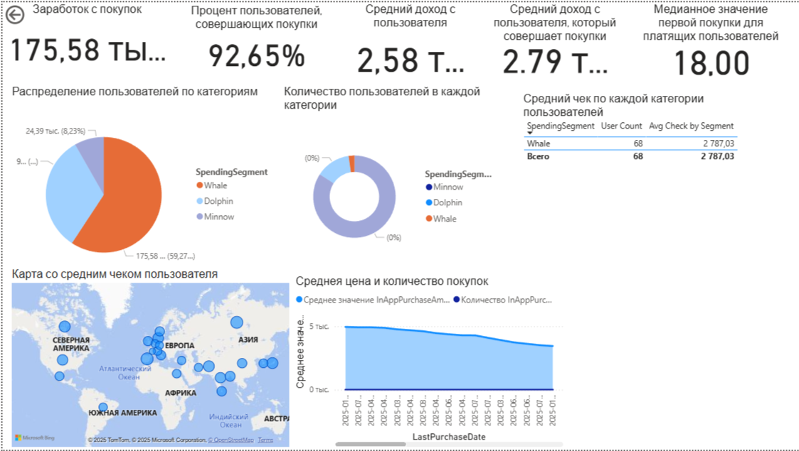
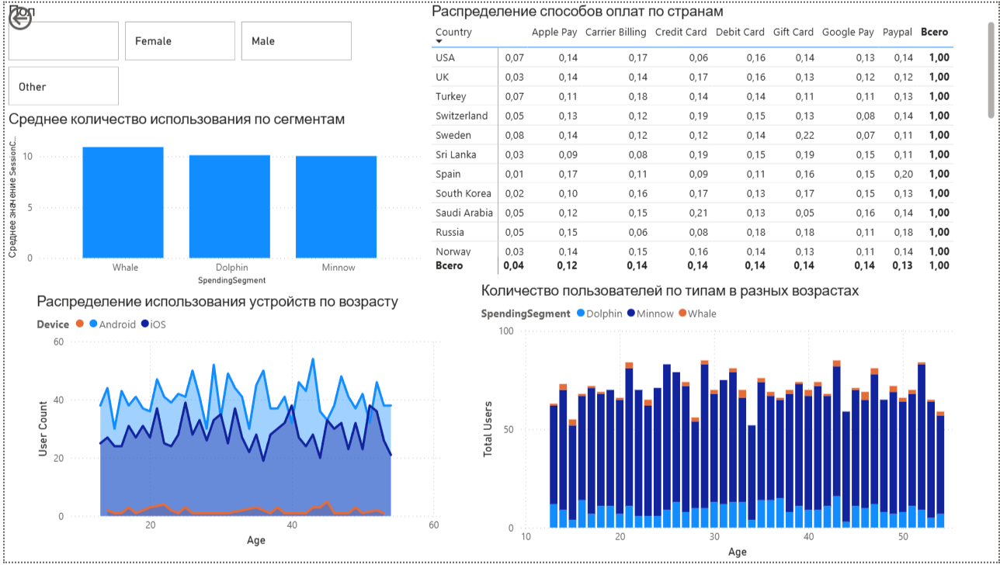

# 🎮 Дашборд аналитики мобильных игр

Комплексный Power BI дашборд для анализа поведения игроков и оптимизации монетизации в мобильных играх.
Дашборд предоставляет глубокую аналитику платежного поведения игроков на основе модели сегментации "Киты vs Мальки". Помогает разработчикам и продукт-менеджерам оптимизировать стратегии монетизации и улучшать удержание пользователей.

## 🎯 Ключевые возможности

- Анализ доходов по странам и регионам
- Распределение платежных методов (карты, PayPal, Google Pay)
- Динамика выручки по месяцам
- Демографический анализ (возраст, устройства)
- Выявление пользователей в риске оттока

## 📊 Визуализация дашборда

Вот несколько примеров того, как выглядит аналитика в дашборде:

**Общий вид дашборда**

**Анализ доходов по странам и типам пользователей**

**Распределение платежных методов, типу устройств пользователей**

## 🛠️ Технический стек

- **Power BI** с мерами DAX
- **Данные**: 3024 записи пользователей с 13 атрибутами
- **Сегменты**: Киты, Дельфины, Минно на основе платежного поведения
- **Платформы**: Анализ iOS и Android

## 📋 Набор данных включает

- Демографию пользователей (Возраст, Пол, Страна)
- Игровое поведение (Сессии, Время игры, Жанр)
- Транзакционные данные (Сумма покупок, Методы оплаты)
- Временной анализ (Даты первой/последней покупки)

##  Использование

- Оптимизация стратегий монетизации
- Таргетинг рекламных кампаний
- Прогнозирование оттока пользователей
- Анализ эффективности платежных систем

